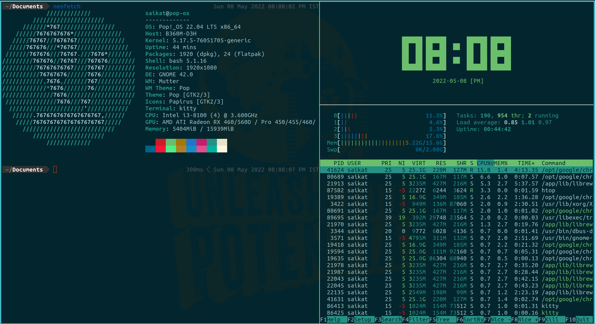
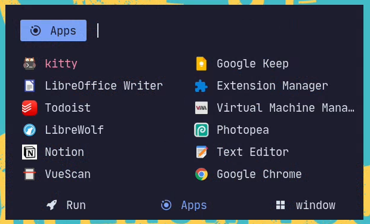

# linux-dots

## Install the Apps 
### on debian based distros
- `sudo apt install kitty rofi papirus-icon-theme gparted preload neofetch htop -y`
### for arch linux based distors
- `sudo pacman -S kitty rofi papirus-icon-theme gparted neofetch htop -y`
- `pikaur -S preload`
---

## fonts and dotfiles for my linux machine.
- .config - contains the config files for different apps.
- .fonts - contains some custom fonts.
---

### add some nerdfonts & fix bengali font issue on linux
- clone the repo
- run `cd linux-dots; mkdir -p ~/.fonts; mv .fonts ~/; fc-cache -fv;`
- then `reboot`
---

## install the rofi theme 
- clone the repo
- make folders `mkdir -p ~/.config/rofi ~/.local/share/rofi/themes`
- then `cd linux-dots; cp -r .config/rofi/. ~/.config/rofi/`
- copy the files `cp -r catppuccin.rasi ~/.local/share/rofi/themes/`
- run in terminal `rofi -show drun` or set a keyboard shortcut like : `super + space`
### another style for rofi
- `cd ~/.config/rofi/`
- rename the files `mv config.rasi config.rasi.bak; mv config.rasi.alt config.rasi`
- run in terminal `rofi -combi-modi window,drun,run -show combi`
---

## install kitty theme 
- clone the repo then cd `linux-dots`
- create folder `mkdir -p ~/.config/kitty`
- copy the files `cp -r .config/kitty/. ~/.config/kitty`

### Install Flatpak
- on arch based: `sudo pacman -S flatpak;` then `reboot`
- on pop_os: `sudo apt install flatpak; flatpak remote-add --user --if-not-exists flathub https://flathub.org/repo/flathub.flatpakrepo;` then `reboot`
- for more check : https://flatpak.org/setup/

### must have flatpak apps
- Motrix Downloader - Better IDM alternative with torrent support.
- Librewolf Browser - Bettter Firefox fork.
- VLC Media Player - For watching movies.
- Telegram App - Best IM App.
- New Sleek Gnome Text Editor - Alternative to Sublime/Notepad.
- PDF Tool - Can be done online but a having a offline app is better.
#### paste the whole command in terminal
`flatpak install flathub net.agalwood.Motrix -y;
flatpak install flathub io.gitlab.librewolf-community -y;
flatpak install flathub org.videolan.VLC -y;
flatpak install flathub org.telegram.desktop -y;
flatpak install flathub org.gnome.TextEditor -y;
flatpak install flathub com.github.jeromerobert.pdfarranger -y;`

### optional apps
- Extension Manager for Gnome
- File Organizer
- Screen Breaktimer App

`flatpak install flathub com.mattjakeman.ExtensionManager -y;
flatpak install flathub org.librehunt.Organizer -y;
flatpak install flathub org.gnome.BreakTimer-y;`

### remove unused space from flatpak
- `flatpak uninstall --unused`
---

## screenshots
### kitty terminal theme

  

### rofi launcher theme

  

## forever grateful to linux creators and the community 💝

